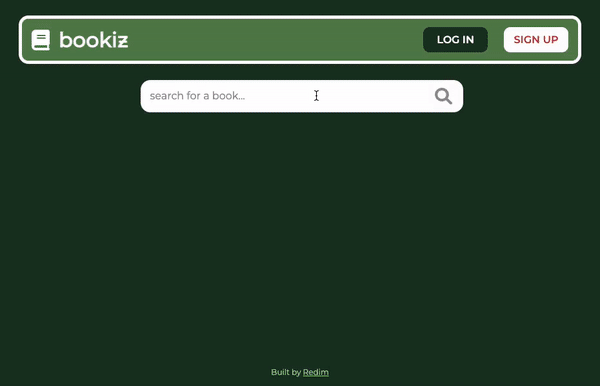

# Bookiz

### Live link: 
- https://redimameti.github.io/bookiz/

## MVP

Create a page that allows users to search for books
Page should include the following:

-   Header section introducing the page
-   Form containing a text input and a submit / search button
-   A grid of books

## Design and Implementation

I used Figma to create the design and went with a green palette for a stable and relaxing feel.

This is my first application built in React JS, and also the first time I've built around an API. This presented me with the challenge of brushing up on rules around using state in react while also getting the hang of the Google Books API. I'm pleased with the finished product though.

